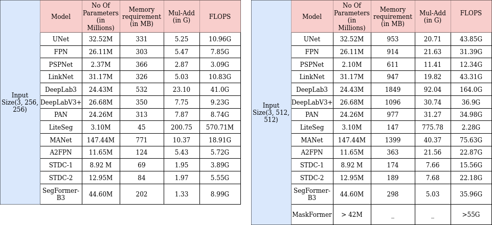
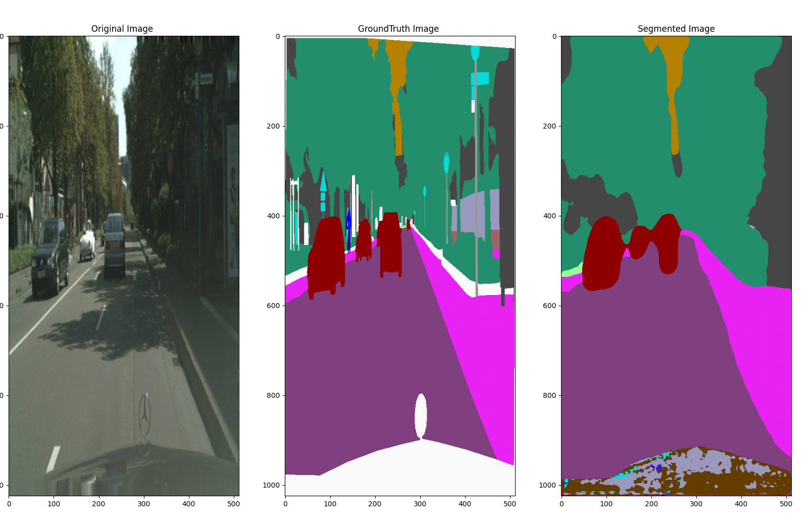

# Dependency

Install the below packages:

```
    pip3 install segmentation_models_pytorch torchsummary torchstat flopth ptflops

```

# How to train on CityScapes Dataset:

## Setting CityScpes Datasets
Download [CityScapes](https://www.cityscapes-dataset.com/) dataset after successful registration.This registration process might take few days.(For me,it took 3 days)

Set the Cityscapes dataset path as mentioned below:

```
[config.py]
# Add the path for cityscapes Dataset
CITYSCAPES_DATASET = <path>

```

## Training:

Use the below command for training.

```
python3 training_cityscapes.py --arch deeplabv3+ --traintype parallel --epochs 50 --outpath savedModels

```

 --arch = Choose any architecure from ['unet', 'manet', 'linknet', 'pspnet', 'pan', 'deeplabv3', 'deeplabv3+', 'manet','fpn','segformer-b3', 'liteseg']

 --traintype: choose between these 2 aviable option ['single', 'parallel'].If multiple GPUs are availble,then choose 'parallel'.Otherwise, it should be 'single'.

 --epochs : Number of epochs.

 --outpath: Path where model will be saved.

## Inference:

Use the below command for inference:

```
python3 inference_cityscapes.py --arch deeplabv3+ --model savedModels/model_deeplabv3_40.pth --save True

```
 --arch = Choose any architecure from ['unet', 'manet', 'linknet', 'pspnet', 'pan', 'deeplabv3', 'deeplabv3+', 'manet','fpn','segformer-b3', 'liteseg'].

 --model= Path of the model.

 --save = [True | False], for saving the output.


# How to Profile

```
python3 semantic-network-arch.py --arch a2fpn --width 256 --height 256 --profiler all
```
 --arch = Choose any architecure from ['unet', 'manet', 'linknet', 'pspnet', 'pan', 'deeplabv3', 'deeplabv3+', 'manet','fpn','segformer-b3', 'liteseg'].

 --profiler = ['torchsummary', 'flopth', 'ptflops', 'stat', 'all'].You can choose any of the tool to do the profiling.


## Evaluation

The below evaluation done with backbone network = resnet50 and input size = (3, 256, 256)/(3, 512, 512).



# Output:

Here is the output with DeeplabV3+ architecture after 40 epochs of training.



Download the model from [Download Link](https://drive.google.com/file/d/1Xn1RpVcEOkTbGCoG0todGP4NW9utuN5D/view?usp=sharing)

# References
- https://github.com/qubvel/segmentation_models.pytorch.
- https://github.com/tahaemara/LiteSeg.
- https://dev.to/_aadidev/3-common-loss-functions-for-image-segmentation-545o.
- https://www.kaggle.com/code/sungjunghwan/loss-function-of-image-segmentation.
- https://machinethink.net/blog/how-fast-is-my-model/.
- https://arxiv.org/abs/1912.06683.
- https://github.com/lironui/A2-FPN.
- https://arxiv.org/abs/2105.15203.

---
Reach me @

[LinkedIn](https://www.linkedin.com/in/satya1507/) [GitHub](https://github.com/satya15july) [Medium](https://medium.com/@satya15july_11937)


